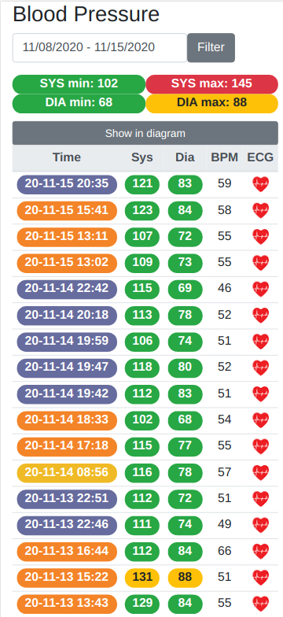

# Withing BPM Web UI
[Withings](https://withings.com/) provides some super simple, amazingly advanced tools for monitoring your health state,
like measuring your blood pressure.
You can access your data collected by their devices, and you can view them by using their web application.

This BPM web application shows an alternative way to view your measurements.


Or in a chart


The classification of blood pressure levels recorded in a medical setting,
and the blood pressure color code can be found [here](https://support.withings.com/hc/en-us/articles/201572026-BPM-Blood-pressure-color-code).
The measurement times are labeled with different colors depending on the time of the day.

In case of your Blood Pressure Monitor device can create electrocardiogram, you can get a complete picture
of your cardiovascular health.


The implementation of the data access layer of this app can be found
in the [Withings Heart API](https://github.com/fejesa/withings-react) repository.

## Installation and getting started
* Download and install [Node.js](https://nodejs.org/) 14+.
* Setup [Withings Heart API](https://github.com/fejesa/withings-react)
* Clone git repo: https://github.com/fejesa/withings-ui
* Open the project folder in a terminal:
```
npm install              # fetches dependencies
npm start                # builds an application and starts the development server
```
* The application is available at http://localhost:4200 from your browser.

Note: The ECG is rendered by the [LightningChart JS](https://www.arction.com/), the data visualization library for JavaScript.
